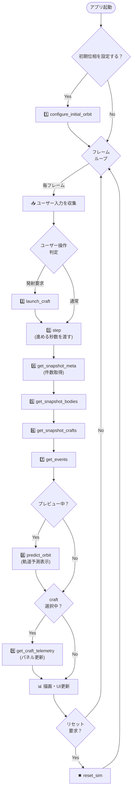

# UI-WASM インタフェース仕様

## 1. 目的

UI（web）と物理計算（engine）を疎結合にし、並行開発を可能にする。

## 2. 対象と非対象

- 対象: web から engine を呼び出す公開API、入出力データ形式、更新ループの契約
- 非対象: 描画デザイン詳細、内部アルゴリズム最適化、UIレイアウト

## 3. 設計方針

- engine はシミュレーション状態の唯一の正本
- web は入力収集と描画に専念
- web は毎フレーム step を呼び、snapshot 取得APIで描画用状態を取得
- APIの入出力フォーマットは TypedArray を採用する

## 4. 用語

- body: 太陽・惑星・月などの天体
- craft: ロケット/人工衛星などの飛行体
- snapshot: ある時刻の描画用状態

## 5. 前提事項

- 座標系: 太陽基準
- 時間ステップ契約: web は 1 回の step で進めるシミュレーション秒を渡し、engine 内部で固定サブステップ積分
- 天体の識別子: 固定IDを採用（天体種別ごとにID帯を分離）
  - 恒星: 0-9（Sun=0）
  - 惑星: 10-99（Mercury=10, Venus=20, Earth=30, Mars=40）
  - 衛星: 100-199（Moon=131。Earth=30 の衛星として 130 番台を利用）
- 太陽（Sun=0）は座標系の原点に固定（x=0, y=0）
- craft 数上限は engine 側の固定値を使用（API で設定しない）
- 天体の初期状態は engine 側の既定軌道を使用し、任意の x, y, vx, vy は受け付けない
- UI から変更可能な初期値は、別APIで「既定軌道上の位相」などの限定パラメータのみを指定する
  - `configure_initial_orbit` を呼ばない場合は、engine 既定の初期位相を使用する
- シミュレーション速度は実行中に変更可能（step に渡すシミュレーション秒を毎フレーム変更して実現）
- 浮動小数点精度: Float64 を採用（全APIで統一）
- カメラ・ビューポート管理: engine は絶対座標を返し、web（UI）側が座標変換を担当する
  - ズーム・パン操作は web 側で実装（engine API は不要）
  - 例: マウスホイール → web が scale を計算 → 描画時に座標変換
  - engine からは常に太陽基準の絶対座標を取得し、web がビューポート内に投影

## 6. API 一覧

- configure_initial_orbit(req: Float64Array) -> i32
- step(control: Float64Array) -> i32
- get_snapshot_meta() -> Uint32Array
- get_snapshot_bodies() -> Float64Array
- get_snapshot_crafts() -> Float64Array
- get_events() -> Uint32Array
- launch_craft(req: Float64Array) -> Uint32Array
- get_craft_telemetry(req: Uint32Array) -> Float64Array
- predict_orbit(req: Float64Array) -> Float64Array
- reset_sim() -> i32

注記:
- i32 の返却はステータスコード（0: 成功、非0: エラー）
- 可変長データは meta で件数を先に取り、その後に本体配列を取得する

## 7. API 詳細（入力/出力定義）

### 7.1 configure_initial_orbit

**概要**: 既定軌道上の初期位相を設定する。任意座標の直接指定は許可せず、教材としての物理一貫性を維持する。未呼び出し時は engine 既定値を使用する。

- 入力: Float64Array length=5

| index | 説明 | 例 |
|---|---|---|
| [0] | 水星の初期位相（度, 0-360） | 10.0 |
| [1] | 金星の初期位相（度, 0-360） | 220.0 |
| [2] | 地球の初期位相（度, 0-360） | 45.0 |
| [3] | 火星の初期位相（度, 0-360） | 300.0 |
| [4] | 月の初期位相（地球に対する相対位相, 度, 0-360） | 180.0 |

- 出力: i32 status

- デフォルト値（`configure_initial_orbit` 未呼び出し時）

| 項目 | デフォルト値 |
|---|---|
| 水星の初期位相 | 0.0 |
| 金星の初期位相 | 0.0 |
| 地球の初期位相 | 0.0 |
| 火星の初期位相 | 0.0 |
| 月の初期位相（地球相対） | 0.0 |

入力サンプル:

```ts
new Float64Array([10.0, 220.0, 45.0, 300.0, 180.0])
```

### 7.2 step

**概要**: シミュレーションを1回進める。1回の呼び出しで指定秒数ぶん進行し、内部で固定刻み幅の多段階積分を実行する。

- 入力: Float64Array length=1

| index | 説明 | 例 |
|---|---|---|
| [0] | この呼び出しで進めるシミュレーション秒 | 60.0 |

補足:
- この値は実時間ではなく、シミュレーション内で進める秒数。
- 例: 1フレームごとに 60.0 を渡すと、1フレームで60秒分進む。
- 一時停止したい場合は step を呼ばない（または 0 を渡す）。

- 出力: i32 status

入力サンプル:

```ts
new Float64Array([60.0])
```

### 7.3 get_snapshot_meta

**概要**: 現フレームのシミュレーション状態メタデータを取得。body・craft・event の件数と現在の tick 数を返す。可変長データを取得する前に必ず呼び出す。

- 入力: なし
- 出力: Uint32Array length=4

| index | 説明 | 例 |
|---|---|---|
| [0] | body レコード数 | 6 |
| [1] | craft レコード数 | 2 |
| [2] | event レコード数 | 1 |
| [3] | シミュレーションtick（`step` 成功ごとに +1 される内部更新番号） | 1842 |

補足:
- `tick` は描画更新やイベント処理の重複防止に使う単調増加カウンタ。
- UI 利用例:
  - 前回取得した tick と同値なら再描画を省略。
  - tick が進んだときだけ HUD や軌跡を更新。
  - tick が小さくなった場合は reset_sim 後とみなしてUI状態を初期化。

出力サンプル:

```ts
new Uint32Array([6, 2, 1, 1842])
```

### 7.4 get_snapshot_bodies

**概要**: 全天体（body）の位置・速度・描画パラメータのスナップショットを取得。描画や距離計算に使用。

- 入力: なし
- 出力: Float64Array length=天体数 * 7
- 1 body あたりのレコード（7要素）

補足:
- 2次元配列ではなく 1 次元 TypedArray を使う理由は、WASM 境界で連続メモリをそのまま受け渡せるため。
- ネスト構造の生成・分解コストを避けられ、描画ループでの割り当ても減らせる。

| index | 説明 | 例 |
|---|---|---|
| [0] | 固定ID | 30（Earth） |
| [1] | x座標 | 149.6 |
| [2] | y座標 | 0.0 |
| [3] | x方向速度 | 0.0 |
| [4] | y方向速度 | 29.78 |
| [5] | 描画半径 | 6.0 |
| [6] | 質量スケール値 | 1.0 |

出力サンプル（2 body）:

```ts
new Float64Array([
  0, 0.0, 0.0, 0.0, 0.0, 20.0, 333000.0,
  30, 149.6, 0.0, 0.0, 29.78, 6.0, 1.0,
])
```

補足: `step` → `meta` → `bodies/crafts/events` の分割設計について
- TypedArray は取得前に必要サイズを知る必要があるため、`meta` で件数を先に取得する。
- body/craft/event は更新頻度や利用目的が異なるため、分割取得の方が無駄コピーを減らせる。
- UI 側はラッパー関数で統合呼び出しできるため、利用コードの煩雑さは吸収可能。

### 7.5 get_snapshot_crafts

**概要**: 全飛行体（craft）の位置・速度・ミッション状態を取得。描画とUI情報表示に使用。

- 入力: なし
- 出力: Float64Array length=飛行体数 * 7
- 1 craft あたりのレコード（7要素）

補足:
- body と同様に 1 次元 TypedArray を採用し、WASM <-> UI 間のコピーとGC負荷を最小化する。

| index | 説明 | 例 |
|---|---|---|
| [0] | craft 識別子 | 1 |
| [1] | x座標 | 150.2 |
| [2] | y座標 | 0.4 |
| [3] | x方向速度 | 0.8 |
| [4] | y方向速度 | 31.2 |
| [5] | ミッション状態コード | 0 |
| [6] | 最接近天体の識別子 | 30 |

出力サンプル（1 craft）:

```ts
new Float64Array([1, 150.2, 0.4, 0.8, 31.2, 0, 30])
```

### 7.6 get_events

**概要**: 前回 get_events 呼び出し以降に発生したイベントを全件取得する。読み取り後、内部イベントキューはクリアされる。

- 入力: なし
- 出力: Uint32Array length=イベント数 * 4
- 1 event あたりのレコード（4要素）

| index | 説明 | 例 |
|---|---|---|
| [0] | イベント種別コード | 1（mission） |
| [1] | 対象飛行体の識別子 | 1 |
| [2] | 関連天体の識別子 | 131（Moon） |
| [3] | 詳細コード | 1（moon_reached） |

- 取得契約: 前回取得以降に発生したイベントを全件返却し、読み取り後に内部キューをクリア

出力サンプル（1 event）:

```ts
new Uint32Array([1, 1, 131, 1])
```

### 7.7 launch_craft

**概要**: 指定された天体から飛行体を発射する。初速度・角度・発射モードを指定。成功時に新しい飛行体の識別子を返す。

補足:
- この API はフレーム内の細かい発射時刻までは表現しない。
- `launch_craft` は「発射要求を登録するAPI」とし、反映タイミングは次の `step` 呼び出し開始時とする。
- したがって発射タイミングの粒度は `step` 呼び出し単位であり、同一フレーム内の途中時刻は区別しない。
- 現要件では発射角度・初速・発射操作は求められているが、フレーム内の厳密な発射時刻指定は求められていないため、この粒度で問題ない。

- 入力: Float64Array length=4

| index | 説明 | 例 |
|---|---|---|
| [0] | 発射モード（0: 手動。角度・初速をそのまま使用 / 1: 自動。円軌道相当の初速を engine が自動計算） | 0 |
| [1] | 発射元天体の識別子 | 30（Earth） |
| [2] | 発射角度（度）※ mode=1 の場合は無視可 | 45.0 |
| [3] | 初速 ※ mode=1 の場合は無視可 | 8.2 |

- 出力: Uint32Array length=2

| index | 説明 | 例 |
|---|---|---|
| [0] | ステータスコード | 0 |
| [1] | 作成された飛行体の識別子 | 7 |

- 返却契約:
  - 成功時はその場で飛行体の識別子を返す。
  - ただし返した飛行体が座標列に現れるのは、次回 `step` 実行後の `get_snapshot_crafts` 以降とする。

入力サンプル:

```ts
new Float64Array([0, 30, 45.0, 8.2])
```

出力サンプル:

```ts
new Uint32Array([0, 7])
```

### 7.8 get_craft_telemetry

**概要**: 特定の飛行体の詳細テレメトリーを取得。速度・高度・加速度・最寄り天体情報を返す。UI パネル更新時に使用。

- 入力: Uint32Array length=1

| index | 説明 | 例 |
|---|---|---|
| [0] | 対象飛行体の識別子 | 7 |

- 出力: Float64Array length=7

| index | 説明 | 例 |
|---|---|---|
| [0] | 対象飛行体の識別子 | 7 |
| [1] | 速度 | 8.05 |
| [2] | 地球からの高度 | 1234.5 |
| [3] | 加速度 | 0.021 |
| [4] | 最寄り天体ID | 131 |
| [5] | 最寄り天体までの距離 | 233.1 |
| [6] | ミッション状態コード | 0 |

入力サンプル:

```ts
new Uint32Array([7])
```

出力サンプル:

```ts
new Float64Array([7, 8.05, 1234.5, 0.021, 131, 233.1, 0])
```

### 7.9 predict_orbit

**概要**: 仮想的な発射条件下での軌道を予測し、計算済みの座標系列を返す。発射前プレビュー表示に使用。

- 入力: Float64Array length=6

| index | 説明 | 例 |
|---|---|---|
| [0] | 発射モード | 0 |
| [1] | 発射元天体の識別子 | 30 |
| [2] | 発射角度（度） | 45.0 |
| [3] | 初速 | 8.2 |
| [4] | 予測点数 | 256 |
| [5] | 予測積分の刻み秒 | 0.05 |

- 入力制約: steps は 1 以上 1024 以下
- 出力: Float64Array length=steps * 2
- 1点あたり（2要素）

| index | 説明 | 例 |
|---|---|---|
| [0] | x座標 | 150.3 |
| [1] | y座標 | 0.5 |

入力サンプル:

```ts
new Float64Array([0, 30, 45.0, 8.2, 256, 0.05])
```

出力サンプル（先頭3点のみ例示）:

```ts
new Float64Array([
  150.3, 0.5,
  150.7, 0.9,
  151.0, 1.4,
])
```

### 7.10 reset_sim

**概要**: シミュレーションを初期状態にリセット。全 craft を削除し、時刻を 0 に戻す。

- 入力: なし
- 出力: i32 status

出力サンプル:

```ts
0
```

## 8. 列挙値定義

**注記**: 以下の定義は仕様の参考値です。web 側では TypeScript で定数オブジェクトを定義して参照・比較することを推奨します。

```ts
// web 側での参照例
const StatusCode = {
  OK: 0,
  INVALID_ARGUMENT: 1,
  NOT_FOUND: 2,
  OUT_OF_RANGE: 3,
  INTERNAL_ERROR: 4,
} as const;

// 使用例
const result = engine.step(new Float64Array([60.0]));
if (result === StatusCode.OK) { /* 成功 */ }
```

### 8.1 status code

API 関数の戻り値（i32）。engine 側での処理結果を示す。

| 値 | 定数名 | 説明 |
|---|---|---|
| 0 | OK | 成功 |
| 1 | INVALID_ARGUMENT | 入力パラメータが無効 |
| 2 | NOT_FOUND | 指定のリソース（飛行体識別子など）が存在しない |
| 3 | OUT_OF_RANGE | 入力値が有効範囲外（例: steps > 1024） |
| 4 | INTERNAL_ERROR | engine 内部エラー |

### 8.2 mission_state

craft のミッション状態。get_snapshot_crafts の出力 [5] および get_craft_telemetry の出力 [6] に含まれる。

| 値 | 定数名 | 説明 |
|---|---|---|
| 0 | flying | 飛行中 |
| 1 | moon_reached | 月に到達 |
| 2 | sun_fallen | 太陽に落下 |
| 3 | out_of_bounds | シミュレーション範囲外に逃出 |
| 4 | collided | 衝突 |

### 8.3 event_type

イベント種別。`get_events` の出力 `[0]` に含まれる。同時に複数のイベントが発生した場合は、複数の event エントリが返される。

| 値 | 定数名 | 説明 |
|---|---|---|
| 0 | none | イベント無し（予約値） |
| 1 | mission | ミッション状態変化（完了・失敗など） |
| 2 | collision | 衝突検出 |
| 3 | warning | 警告（例: 大気圏突入警告） |

### 8.4 body_kind（ID帯対応）

body のカテゴリ。天体の識別子から種別を判定する際に参考。

| 値 | 定数名 | ID帯 | 説明 |
|---|---|---|---|
| 0 | star | 0-9 | 恒星（太陽など） |
| 1 | planet | 10-99 | 惑星 |
| 2 | satellite | 100-199 | 衛星・月など |

**判定例**:
```ts
const getBodyKind = (bodyId: number) => {
  if (bodyId <= 9) return 0;  // star
  if (bodyId <= 99) return 1; // planet
  return 2;                     // satellite
};
```

## 9. 更新ループ契約（web-engine 間）

以下は毎フレーム実行される典型的なシーケンス図です。ユーザー操作に応じて、optional な関数（launch_craft など）が挿入されます。



### 処理順序の詳細

| 段階 | 関数 | 条件 | 説明 |
|------|------|------|------|
| 起動時 | `configure_initial_orbit` | 任意 | 既定軌道上の初期位相を設定 |
| 毎フレーム | `step` | 常に | 時間進行、物理更新 |
| 毎フレーム | `get_snapshot_meta` | 常に | 描画用データの件数を先読み |
| 毎フレーム | `get_snapshot_bodies` | 常に | body 座標・描画パラメータ取得 |
| 毎フレーム | `get_snapshot_crafts` | 常に | craft 座標・ミッション状態取得 |
| 毎フレーム | `get_events` | 常に | 新規イベント確認、ポップアップ表示 |
| 毎フレーム | `get_craft_telemetry` | craft 選択時 | 詳細情報パネル更新 |
| ユーザー操作 | `launch_craft` | 発射時 | 発射要求を登録し、次の `step` で反映 |
| プレビュー中 | `predict_orbit` | 発射前のみ | 軌道予測表示用 |
| ユーザー操作 | `reset_sim` | リセット時 | 初期状態へ戻す |

### 要点

- **初期化**: 必要時のみ `configure_initial_orbit` を呼ぶ
- **毎フレーム**: `step` → 全データ取得（meta/bodies/crafts/events）の流れが基本
- **オプション**: launch・パネル更新・プレビューはユーザー操作に応じて挿入
- **イベント処理**: `get_events` で取得後、自動クリア。毎フレーム確認する
