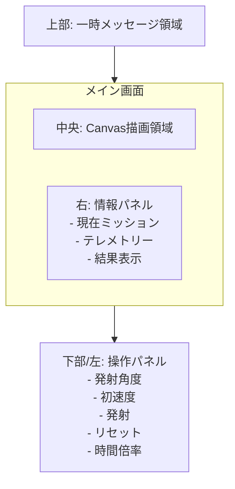

# 詳細仕様書（画面仕様）：Solar Gravity Simulator

**前提：** PCブラウザ最適化を優先。スマホは最低限操作を保証（スマホブラウザを対象、ネイティブアプリは対象外）

---

## 1. 目的

利用者がパラメータを変えながら軌道を観察し、ミッションを段階的に攻略できるUI仕様を定義する。

---

## 2. 画面レイアウト

### 2.1 領域構成

- 中央：Canvas描画領域
- 上部：一時メッセージ領域
- 右：情報パネル（テレメトリー + ミッション + 結果）
- 下部または左：操作パネル（発射条件、時間倍率、制御ボタン）

### 2.2 表示優先

- 学習の注目対象（対象天体、ロケット軌道）を優先表示
- 非注目天体は薄表示または縮小表示を許容

### 2.3 UIイメージ

---

## 3. 操作仕様

### 3.1 発射入力

- 発射角度：スライダー + 数値入力
- 初速度：スライダー + 数値入力
- 角度と速度は相互同期

### 3.2 ボタン

- 発射
- リセット
- 一時停止/再開

### 3.3 時間倍率

- 段階選択：一時停止 / 1x / 2x / 4x

### 3.4 ミッション

- 現在ミッション名・目標を表示
- 解放済みミッションのみ選択可能

---

## 4. カメラ仕様

- ホイールズーム
- ドラッグパン
- ズーム最小値・最大値を制限
- パン範囲は無制限または大きめ制限

MVP外：

- 天体クリック追従カメラ
- 自動フォーカス遷移演出

---

## 5. 描画仕様

### 5.1 天体

- 色のみで描画（テクスチャ不使用）
- 太陽、水星、金星、地球、月、火星を表示
- ミッション対象は強調表示

### 5.2 ロケット

- 単色の簡易形状で描画
- ロケット軌跡は色付きラインで表示

### 5.3 補助表示

- 軌道ガイド表示（ON/OFF）
- 天体トレイル表示（ON/OFF）

---

## 6. メッセージ・パネル仕様

### 6.1 上部一時メッセージ

表示対象：

- 発射
- 到達
- ミッション成功
- ミッション失敗

表示は短時間で自動消去。

### 6.2 右パネル常時表示

- 現在ミッション
- テレメトリー（最新ロケット1機）
  - 現在速度
  - 地球からの高度
  - 重力加速度
  - 最も近い天体と距離

### 6.3 右パネル結果表示

ミッション終了時に表示。

- 成功/失敗
- 経過時間
- 最大距離
- 対象天体への最接近距離
- 状態（落下 / 軌道 / 脱出 の簡易分類）

---

## 7. ミッションUI仕様

### 7.1 段階構成

- M1: 地球の周回軌道に乗る
- M2: 地球から脱出
- M3: 地球から月を周回
- M4: 地球から火星を周回
- M5: 地球から金星を周回

### 7.2 MVP提供範囲

- 初版必須：M1, M2
- 拡張追加：M3, M4, M5

### 7.3 ヒント表示

- ミッションごとに短いヒントを表示
- 直接的な解答値は表示しない

---

## 8. 状態遷移（UI）

### 8.1 基本遷移

- Idle（発射待ち）
- Running（飛行中）
- FinishedSuccess（成功停止）
- FinishedFailed（失敗停止）

### 8.2 遷移条件

- 発射で `Idle -> Running`
- 成功判定で `Running -> FinishedSuccess`
- 失敗判定で `Running -> FinishedFailed`
- リセットで任意状態から `Idle`

注記：

- 成功/失敗判定の確定は物理側で実施し、UI側は表示と遷移反映を担当する

---

## 9. 進捗保持

MVP既定：

- ミッション進捗はセッション内のみ保持
- ページ再読み込みで初期化

将来拡張：

- LocalStorage保存対応

---

## 10. アクセシビリティと可読性

- 主要テキストは十分なコントラストを確保
- 数値表示は桁数を丸めて読みやすくする
- PC操作を優先しつつ、タッチでも最低限のボタン操作は可能にする

---

## 11. 非機能要件（UI）

- 最低保証は30fpsを目標とする
- PCブラウザでは60fpsをベストエフォート目標とする
- 操作入力から見た目反映まで体感遅延を低く保つ
- 画面リサイズ時にレイアウト崩れを起こさない

---

## 12. 実装上の注記

- 右パネルのメッセージは「常時情報」と「一時通知」を混在させない
- 一時通知は上部、説明情報は右パネルに分離
- 判定しきい値はUIに固定表示せず、内部定数として管理
- WASM API のスキーマ（厳密フィールド定義）は実装と接続テストの中で確定する

---

## 12-1. 開発規約（コード品質）

- Linter：ESLint（Google スタイルガイド準拠）
- Formatter：Prettier（Google スタイルガイドに沿った設定）
- TypeScript のコーディング規約は Google TypeScript Style Guide に従う
